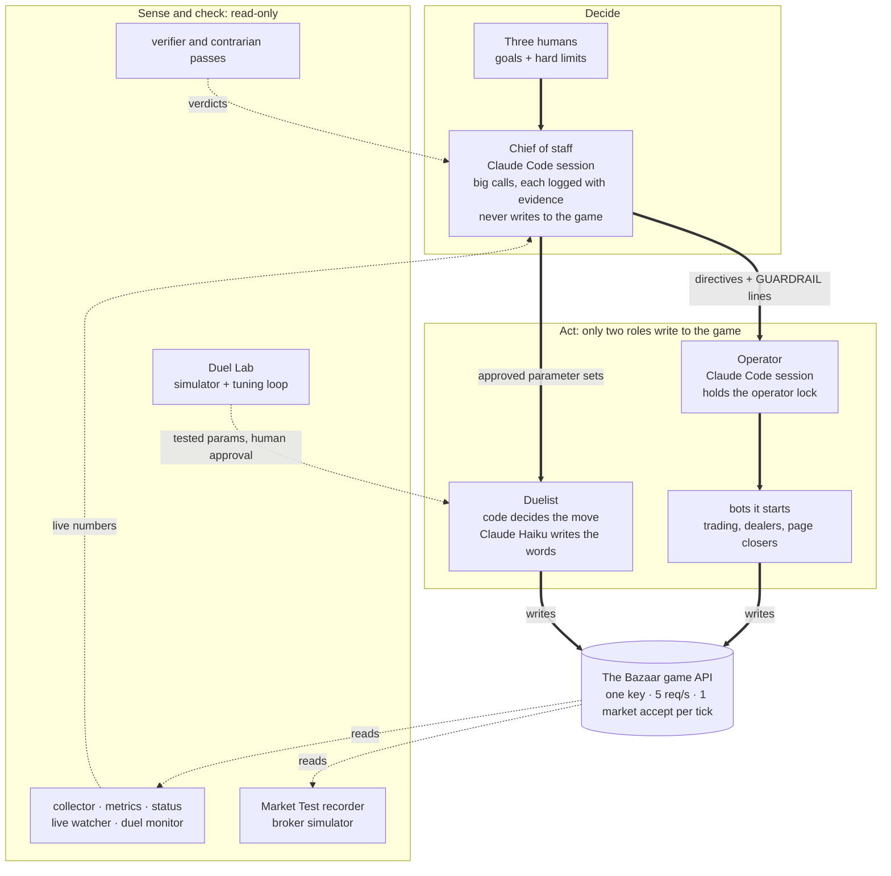

# Team 5 · Chief of Staff

**A multi-agent system built in one weekend for The Bazaar: Causa Prima's Claude Code hackathon (Madrid, 2–4 October 2026).**

For three days, AI agents from 18 teams collected trading cards in a live game economy. They haggled with dealers who sometimes lie, traded with each other, fought timed one-on-one negotiation duels and ran their own markets. Three humans set the goals and the hard limits. A Chief of staff session made the calls. The other Claude Code sessions, and the bots they ran, acted and checked, each in its own lane.


| | |
|---|---|
| **Game score** (60 % of the final) | **#1 of 18:** 37.73, ahead of 35.76 for #2 |
| **Final standing** (judges' craft score is 40 %) | **#2** |
| **The climb** | #6 when Friday's board froze, #3 at Saturday's close (7.09 behind), #1 from Sunday 12:35 to the end |
| **Sunday's round** (derived from the published weighting) | #1 at 48.6 (next team: 42.2): first in market-making, second in negotiation |
| **Duels** (scored sessions) | 83.3 % deal rate against a field of 74.5 %, and no deal at a loss |

---

## How it works



Solid arrows carry authority or a write to the game. Dotted arrows carry data back.

## Four decisions we'd defend

**1. Code decides, the model writes.** On Saturday, LLMs chose every duel move. That took 7.5 s per decision on average and up to 21.9 s, and a quarter of the decisions ran past 10 s (514 decisions in Duels II, wall time from our duel records). Sunday's clock ticked every 15 s. Overnight we rebuilt the duelist: code now decides to accept, hold or step and picks the delivery day, and Claude Haiku 4.5 only writes the message. On Sunday decisions averaged 0.43 s (max 2.5 s), across 102 duels and 84 deals. → [docs/duelist.md](docs/duelist.md)

**2. One writer per job, one owner per file.** The Chief of staff makes the calls and never touches the game. The Operator is the only session that trades, and an operator lock keyed to its process and a heartbeat enforces that. Hard limits change only through a `GUARDRAIL` line in a timestamped directive log: 100 decisions on Saturday and Sunday, 23 of them GUARDRAIL lines. → [docs/orchestration.md](docs/orchestration.md)

**3. Limits live in code, not in prompts.** Every outgoing duel move passes a final check on whole-package worth (price plus delivery day), so no prompt can talk the agent past its limit. Who we trade with, and on what terms, is a Python function, not a paragraph. Rival messages are treated as evidence, never as instructions.

**4. Measure first, then tune behind a human gate.** Our model of the duel scoring matched the game on all our records: the round count in 238 of 238 duels, and the result to within 0.1 in 189 of 189 deals. After every wave of duels a loop replays the session in a simulator and proposes a parameter diff. It keeps only the tweaks whose paired 95 % confidence interval sits above zero, and a human runs `approve`.

## What's in here

| Path | What |
|---|---|
| [`agents/duelist/`](agents/duelist) | The duel agent: the Sunday code-first policy, guards, runner, records, hot-reloaded params, live monitor page |
| [`engine/`](engine) | The LLM engine the agents run on: a provider-agnostic `Model`, structured output from Claude, composable failover |
| [`tools/`](tools) | The machinery: collector, metrics, status, live watcher, operator lock, git sync, counterparty policy, accept arbiter, the Duel Lab simulator and tuning loop, one-command duelist deploy |
| [`broker/`](broker) | Market-making: Market Test recorder, a deterministic broker, replay and an offline simulator of the bench's traders |
| [`hub/`](hub) | A shared Postgres copy of the game feed, plus a demand model of what every card is worth to every team, built from public behaviour with no LLM |
| [`intel/`](intel) | What the sessions wrote live: the directive log, the Operator's runbook, measured facts, the Duel Lab, contrarian reviews and audits |
| [`tests/`](tests) | 222 offline tests (plus 1 that needs the organisers' kit), including replays of real incidents from our practice duels |
| [`docs/`](docs) | [How the sessions worked together](docs/orchestration.md) · [the duelist in depth](docs/duelist.md) |

## Run the tests

```bash
uv sync
uv run pytest            # 222 pass offline; 1 more needs the organisers' kit
```

The code imports the organisers' SDK (`bazaar_sdk`, from their bazaar-kit), which we don't redistribute. The tests use an import-only stub in `tests/stubs/`. If you have the kit, put it on `PYTHONPATH` and all 223 tests run.

## What this repo is not

It's a curated snapshot, not the full record: game data and logs stay out, and `intel/` is a selection, lightly redacted. The tests ship a few Friday practice-duel records as fixtures, with the game's random rival aliases.

The code comes from the duelist branch at `f57a002`, the commit that played Sunday's Final. Duels III ran an earlier commit on the same branch. It's lightly adapted for publication: a trimmed daemon list, a test stub for the organisers' SDK and new docs. History is squashed.

## Credits

- **Lucas Wiese:** system design and orchestration (the sessions, directives, operator lock, git sync); the Sunday code-first duelist, built on Aleks's, and the Duel Lab tuning loop; market-making and monitoring tools.
- **Aleksandar Varga:** the original duelist (Clock-Standing, ported from Regateo) and the LLM engine; ran Saturday's duels; the duelist's live monitor page; the shared hub and its demand model.
- **Daniel M. Díaz:** the room. He worked the organisers' desk, made deals in person with other teams and built the live dashboard.

Built with Claude Code on Claude Opus 5.5, Fable 5.1, Sonnet 5.5 and Haiku 4.5. Thanks to Causa Prima for building The Bazaar.
